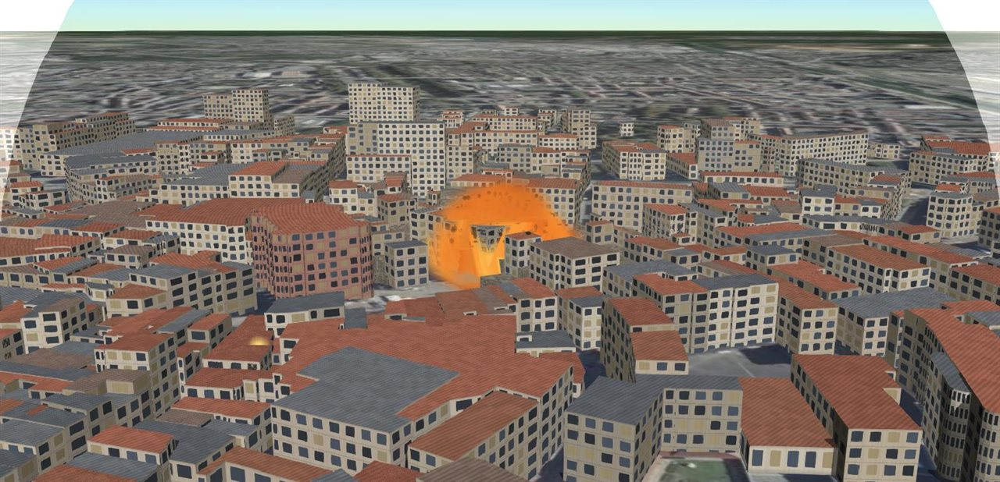
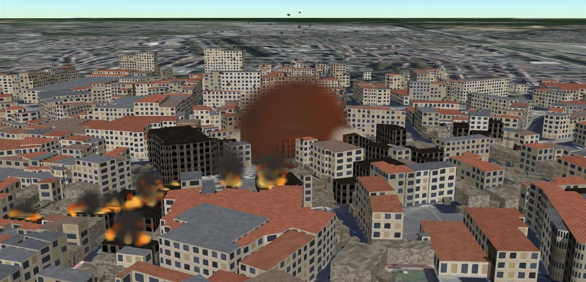
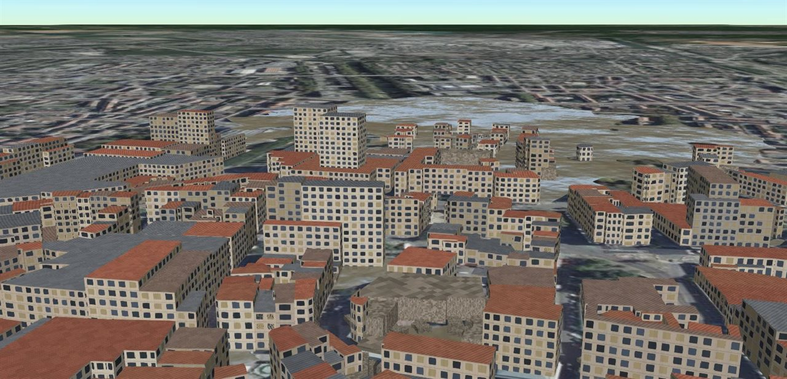
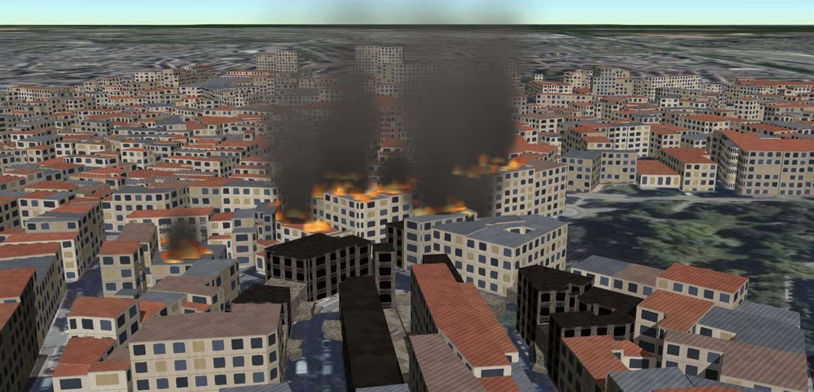

<h1 align="center">Drone Recon</h1>

<p align="center">
  Simulateur de reconnaissance par drone après catastrophe.<br />
  Pilotage aux deux mains par webcam, diagnostic des dommages, simulation de désastres.
</p>

<p align="center">
  <a href="https://github.com/Moundirhzr2/drone-recon/actions/workflows/ci.yml"></a>
  <a href="LICENSE"></a>
  
  
  
</p>


Un drone survole le centre réel de Mulhouse, autour de la place de la Réunion :
2 282 bâtiments reconstitués depuis les données de l'IGN, posés sur le relief et
la photographie aérienne. On le pilote aux gestes devant une webcam, on
photographie le sol à la verticale, et un détecteur classe chaque bâtiment
endommagé — fissuré, partiellement effondré, effondré ou incendié — avec ses
scores de confiance.

Un simulateur rejoue séismes, explosions, inondations et incendies sur ces
bâtiments réels, en tenant compte de leur âge, de leur usage et du matériau de
leurs murs, et les montre se produire : l'eau qui monte, la boule de feu et
l'onde de choc, les flammes et la fumée, la poussière des effondrements.

Le tout tourne dans le navigateur, sans serveur ni clé d'API.

## Contexte

Ce projet est mené en collaboration avec un doctorant de
l'[Université de Haute-Alsace](https://www.uha.fr), à Mulhouse, qui y développe
les algorithmes destinés à le perfectionner.

L'objectif à terme est de sortir de la simulation : transposer ce travail sur de
vrais drones, pour aider les équipes de secours à évaluer rapidement les dégâts
après une catastrophe.

Le code s'y prête : chaque brique — détection, pilotage, simulation — est isolée
derrière une interface remplaçable, de sorte qu'un algorithme issu de ces
travaux peut s'y substituer sans toucher au reste.

## Fonctionnalités

- **Ville réelle** — 2 282 bâtiments de la BD TOPO® extrudés depuis leur contour
  exact, relief RGE ALTI®, photographie aérienne BD ORTHO® ; façades calculées à
  l'échelle réelle, rendus réaliste, fil de fer et scan.
- **Pilotage gestuel** — suivi des deux mains par MediaPipe, disposition Mode 2
  des radiocommandes, gestes pour la photo et la bascule de vue.
- **Instrumentation** — coordonnées GPS en haut à gauche, caméra verticale en
  haut à droite, photos horodatées, vues embarquée et de suivi.
- **Diagnostic** — classification des dommages avec boîtes, scores et rapport ;
  précision et rappel calculés en direct contre la vérité terrain.
- **Simulateur de désastres** — quatre aléas physiquement fondés, une courbe de
  fragilité commune, une chronologie rejouable et parcourable dans les deux sens.
- **Effets visibles** — crue qui monte et remplit les creux du relief, explosion
  (éclair, boule de feu, onde de choc, débris, colonne de fumée), incendies,
  poussière des effondrements, secousse du séisme.
- **Qualité adaptée à la machine** — profil choisi d'après la carte graphique
  (ombres portées, ciel, anticrénelage), puis cadence tenue en vol.

## Démarrage rapide

Prérequis : [Node.js](https://nodejs.org) 20 ou plus récent, et un navigateur
récent avec WebGL 2.

```bash
git clone https://github.com/Moundirhzr2/drone-recon.git
cd drone-recon
npm install
npm run dev
```

L'application s'ouvre sur <http://localhost:5173>. Aucune clé n'est nécessaire :
les bâtiments et le relief sont livrés avec le dépôt, et la photographie aérienne
vient des services publics de l'IGN.

Le profil de qualité est choisi d'après la carte graphique. Pour l'imposer,
ajouter `?qualite=fluide`, `?qualite=equilibre` ou `?qualite=beau` à l'adresse.

Pour piloter aux mains, appuyer sur `H`, autoriser la webcam, puis garder les deux
mains ouvertes et immobiles pendant les trois secondes de calibrage.

## Commandes

| Touche           | Effet                                                     |
| ---------------- | --------------------------------------------------------- |
| `Z` `Q` `S` `D`  | avancer, reculer, translater (`W` `A` `S` `D` en QWERTY)  |
| `↑` `↓`          | monter, descendre                                         |
| `←` `→`          | pivoter                                                   |
| `Espace`         | prendre une photo nadir                                   |
| `V`              | basculer entre vue brute et vue diagnostique              |
| `M`              | changer de rendu : réaliste, fil de fer, scan             |
| `C`              | vue embarquée ou caméra de suivi                          |
| `H` / `K`        | activer le pilotage gestuel / le recalibrer               |
| `Maj`            | stabiliser le drone                                       |
| `R`              | retour au point de décollage                              |
| `1` à `4`        | choisir un aléa : séisme, explosion, inondation, incendie |
| `P`              | lancer ou mettre en pause le sinistre                     |
| `B` / `N`        | sauter avant / après le sinistre                          |
| `Retour arrière` | annuler le sinistre                                       |

Aux mains : la main gauche règle l'altitude et la rotation, la main droite le
déplacement ; un pincement droit prend une photo, un pincement gauche bascule le
diagnostic, deux poings fermés stabilisent le drone. Le détail est dans
[pilotage gestuel](docs/pilotage-gestuel.md).

## Aperçu

<table>
  <tr>
    <td width="50%"></td>
    <td width="50%"></td>
  </tr>
  <tr>
    <td align="center"><sub>Place de la Réunion : bâtiments de l'IGN, ombres, relief réel</sub></td>
    <td align="center"><sub>Diagnostic : chaque bâtiment classé, identifié et situé</sub></td>
  </tr>
  <tr>
    <td></td>
    <td></td>
  </tr>
  <tr>
    <td align="center"><sub>Avant une explosion d'une tonne de TNT…</sub></td>
    <td align="center"><sub>…et après, même cadrage : ruines et carcasses calcinées</sub></td>
  </tr>
  <tr>
    <td></td>
    <td></td>
  </tr>
  <tr>
    <td align="center"><sub>L'explosion : boule de feu et dôme de l'onde de choc</sub></td>
    <td align="center"><sub>Deux secondes plus tard : nuage, débris, premiers feux</sub></td>
  </tr>
  <tr>
    <td></td>
    <td></td>
  </tr>
  <tr>
    <td align="center"><sub>Crue de 3 m : l'eau remplit d'abord le point bas du relief</sub></td>
    <td align="center"><sub>Incendie poussé par le vent de sud-ouest</sub></td>
  </tr>
  <tr>
    <td></td>
    <td></td>
  </tr>
  <tr>
    <td align="center"><sub>Fil de fer : les contours de l'IGN sur la photo aérienne</sub></td>
    <td align="center"><sub>Scan : la classification seule</sub></td>
  </tr>
</table>

## Comment ça marche

**Un bâtiment cède quand l'intensité qu'il subit croise sa vulnérabilité.** Chaque
bâtiment a une vulnérabilité tirée de ses attributs IGN — année de construction,
usage, matériau des murs — et de son élancement.
Chaque aléa produit un champ d'intensité selon sa propre physique — atténuation
macrosismique, loi de Hopkinson-Cranz calée sur les abaques de Kingery-Bulmash,
hauteur d'eau, propagation du feu sous le vent. Une courbe de fragilité unique
convertit les deux en état de dommage.

**Le détecteur a la forme d'un vrai détecteur, sans en être un.** Il lit la
vérité terrain et la restitue en boîtes, classes et scores bruités de façon
réaliste. On peut donc mesurer sa précision en direct, et le remplacer par un
modèle réel sans rien changer en aval.

**Un sinistre est calculé d'avance.** La chronologie complète est construite
avant la première image : elle est rejouable à l'identique, parcourable en
arrière, et son bilan est connu immédiatement. Les effets visuels suivent le
temps de cette chronologie, pas l'horloge : revenir en arrière fait redescendre
l'eau.

## Documentation

| Document                                      | Contenu                                                                 |
| --------------------------------------------- | ----------------------------------------------------------------------- |
| [Données](docs/donnees.md)                    | sources IGN, traitements, corrections, licence                          |
| [Architecture](docs/architecture.md)          | organisation du code, boucle de rendu, repère local de Cesium, textures |
| [Simulateur de désastres](docs/simulateur.md) | courbe de fragilité, physique, calage et effets des quatre aléas        |
| [Diagnostic](docs/diagnostic.md)              | fonctionnement du détecteur, métriques, fonds de scène                  |
| [Pilotage gestuel](docs/pilotage-gestuel.md)  | gestes, choix des deux mains, réglage de la réactivité                  |
| [Performance](docs/performance.md)            | profils de qualité, mesures, pièges de Cesium                           |

## Limites connues

- **Le détecteur est simulé.** Il n'analyse pas l'image ; il bruite la vérité
  terrain. Son interface est prête pour un modèle réel, qui reste à entraîner.
- **Les toits sont plats.** Chaque bâtiment est une extrusion de son contour ;
  les toits à pans, et la flèche du temple Saint-Étienne, ne sont pas modélisés.
- **Le séisme triche sur l'échelle.** Sa profondeur focale est ramenée à 220 m
  pour que le gradient soit visible à l'échelle du quartier ; un vrai foyer
  frapperait la zone de façon uniforme.
- **La crue suit le modèle « de la baignoire ».** L'eau monte à niveau plat sur le
  relief réel, sans tenir compte de la connectivité des creux ni de
  l'écoulement : c'est le bon ordre de grandeur pour une crue lente de plaine.
- **Le temps est comprimé.** Un incendie de quartier se joue en une minute et
  demie ; les flammes durent un quart de minute au lieu de plusieurs heures.
- **La secousse est une convention.** Un drone en vol ne ressent pas un séisme ;
  la caméra tremble pour que l'écran dise que le sol tremble.
- **Le suivi des mains dépend de l'éclairage** et n'a été éprouvé que sur un petit
  nombre de configurations.
- **L'imagerie Esri**, utilisée hors de France, convient à un usage personnel ; un
  déploiement public demanderait une source sous contrat.

## Développement

```bash
npm run dev           # serveur de développement
npm run verify        # formatage, lint, types et build : ce que vérifie la CI
npm run lint:fix      # corriger ce que le linter sait corriger
npm run format        # formater le code
npm run data          # retélécharger bâtiments et relief depuis l'IGN
```

Les réglages — performance, drone, caméra nadir, détecteur, mains — sont
regroupés et commentés dans [`src/core/config.ts`](src/core/config.ts) ; ceux des
profils de qualité dans [`src/world/quality.ts`](src/world/quality.ts).

Voir [CONTRIBUTING.md](CONTRIBUTING.md) pour les conventions du projet.

## Technologies

[CesiumJS](https://cesium.com/platform/cesiumjs/) pour le globe, le rendu 3D et
les particules,
[MediaPipe Hand Landmarker](https://ai.google.dev/edge/mediapipe/solutions/vision/hand_landmarker)
pour le suivi des mains, [earcut](https://github.com/mapbox/earcut) pour les
toitures, [TypeScript](https://www.typescriptlang.org) et [Vite](https://vite.dev).

Données : © IGN — BD TOPO®, RGE ALTI®, BD ORTHO® — Licence Ouverte Etalab 2.0.
Imagerie hors de France : Esri, Maxar, Earthstar Geographics.

## Licence

[MIT](LICENSE) © Moundir Houazar
