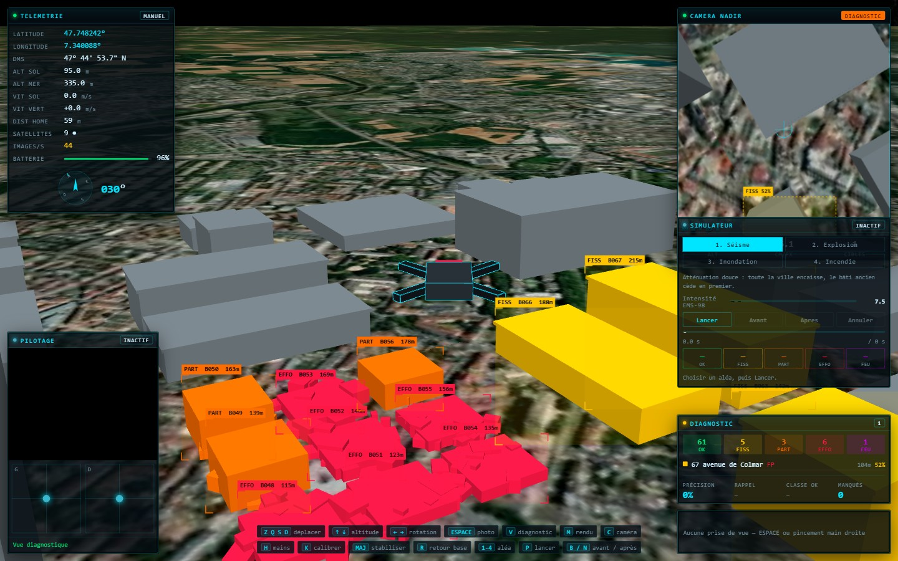
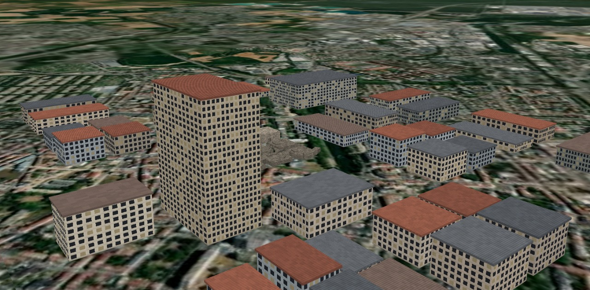
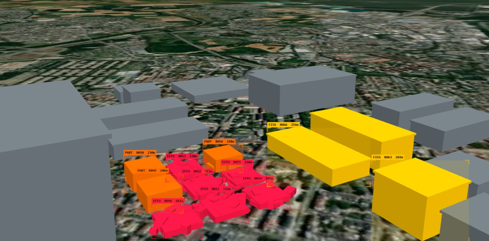
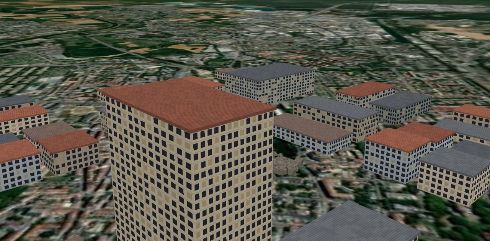
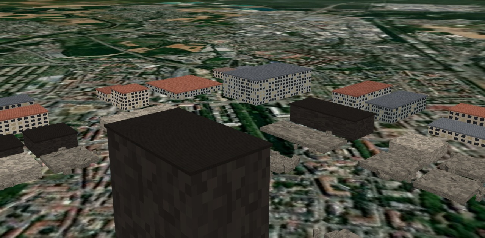
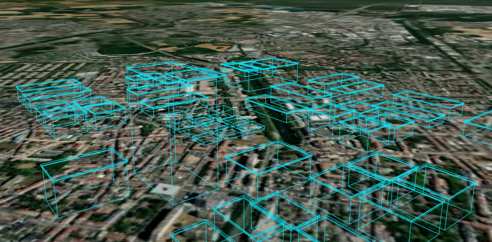
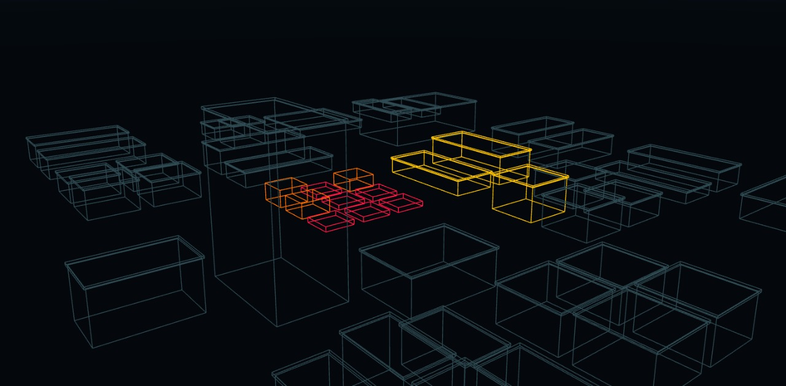

<h1 align="center">Drone Recon</h1>

<p align="center">
  Simulateur de reconnaissance par drone après catastrophe.<br />
  Pilotage aux deux mains par webcam, diagnostic des dommages, simulation de désastres.
</p>

<p align="center">
  <a href="https://github.com/Moundirhzr2/drone-recon/actions/workflows/ci.yml"></a>
  <a href="LICENSE"></a>
  
  
  
</p>



Un drone survole une ville en 3D posée sur de l'imagerie satellite de Mulhouse.
On le pilote aux gestes devant une webcam, on photographie le sol à la
verticale, et un détecteur classe chaque bâtiment endommagé — fissuré,
partiellement effondré, effondré ou incendié — avec ses scores de confiance.
Un simulateur rejoue séismes, explosions, inondations et incendies sur la même
ville, pour produire de nouvelles zones à reconnaître.

Le tout tourne dans le navigateur, sans serveur ni clé d'API.

## Fonctionnalités

- **Environnement 3D** — ville générée de 76 bâtiments sur imagerie satellite,
  façades texturées à l'échelle réelle, rendus réaliste, fil de fer et scan.
- **Pilotage gestuel** — suivi des deux mains par MediaPipe, disposition Mode 2
  des radiocommandes, gestes pour la photo et la bascule de vue.
- **Instrumentation** — coordonnées GPS en haut à gauche, caméra verticale en
  haut à droite, photos horodatées, vues embarquée et de suivi.
- **Diagnostic** — classification des dommages avec boîtes, scores et rapport ;
  précision et rappel calculés en direct contre la vérité terrain.
- **Simulateur de désastres** — quatre aléas physiquement fondés, une courbe de
  fragilité commune, une chronologie rejouable et parcourable dans les deux sens.

## Démarrage rapide

Prérequis : [Node.js](https://nodejs.org) 20 ou plus récent, et un navigateur
récent avec WebGL 2.

```bash
git clone https://github.com/Moundirhzr2/drone-recon.git
cd drone-recon
npm install
npm run dev
```

L'application s'ouvre sur <http://localhost:5173>. Aucune clé n'est nécessaire :
le mode par défaut génère la ville et la pose sur de l'imagerie satellite.

Pour piloter aux mains, appuyer sur `H`, autoriser la webcam, puis garder les deux
mains ouvertes et immobiles pendant les trois secondes de calibrage.

## Commandes

| Touche           | Effet                                                     |
| ---------------- | --------------------------------------------------------- |
| `Z` `Q` `S` `D`  | avancer, reculer, translater (`W` `A` `S` `D` en QWERTY)  |
| `↑` `↓`          | monter, descendre                                         |
| `←` `→`          | pivoter                                                   |
| `Espace`         | prendre une photo nadir                                   |
| `V`              | basculer entre vue brute et vue diagnostique              |
| `M`              | changer de rendu : réaliste, fil de fer, scan             |
| `C`              | vue embarquée ou caméra de suivi                          |
| `H` / `K`        | activer le pilotage gestuel / le recalibrer               |
| `Maj`            | stabiliser le drone                                       |
| `R`              | retour au point de décollage                              |
| `1` à `4`        | choisir un aléa : séisme, explosion, inondation, incendie |
| `P`              | lancer ou mettre en pause le sinistre                     |
| `B` / `N`        | sauter avant / après le sinistre                          |
| `Retour arrière` | annuler le sinistre                                       |

Aux mains : la main gauche règle l'altitude et la rotation, la main droite le
déplacement ; un pincement droit prend une photo, un pincement gauche bascule le
diagnostic, deux poings fermés stabilisent le drone. Le détail est dans
[pilotage gestuel](docs/pilotage-gestuel.md).

## Aperçu

<table>
  <tr>
    <td width="50%"></td>
    <td width="50%"></td>
  </tr>
  <tr>
    <td align="center"><sub>Survol : façades calculées à l'échelle réelle de chaque immeuble</sub></td>
    <td align="center"><sub>Diagnostic : chaque bâtiment classé, identifié et situé</sub></td>
  </tr>
  <tr>
    <td></td>
    <td></td>
  </tr>
  <tr>
    <td align="center"><sub>Avant une explosion de 6 t de TNT…</sub></td>
    <td align="center"><sub>…et après, même cadrage</sub></td>
  </tr>
  <tr>
    <td></td>
    <td></td>
  </tr>
  <tr>
    <td align="center"><sub>Fil de fer</sub></td>
    <td align="center"><sub>Scan : la classification seule</sub></td>
  </tr>
</table>

## Comment ça marche

**Un bâtiment cède quand l'intensité qu'il subit croise sa vulnérabilité.** Chaque
bâtiment a une vulnérabilité tirée de son âge, de son usage et de son élancement.
Chaque aléa produit un champ d'intensité selon sa propre physique — atténuation
macrosismique, loi de Hopkinson-Cranz calée sur les abaques de Kingery-Bulmash,
hauteur d'eau, propagation du feu sous le vent. Une courbe de fragilité unique
convertit les deux en état de dommage.

**Le détecteur a la forme d'un vrai détecteur, sans en être un.** Il lit la
vérité terrain et la restitue en boîtes, classes et scores bruités de façon
réaliste. On peut donc mesurer sa précision en direct, et le remplacer par un
modèle réel sans rien changer en aval.

**Un sinistre est calculé d'avance.** La chronologie complète est construite
avant la première image : elle est rejouable à l'identique, parcourable en
arrière, et son bilan est connu immédiatement.

## Documentation

| Document                                      | Contenu                                                                 |
| --------------------------------------------- | ----------------------------------------------------------------------- |
| [Architecture](docs/architecture.md)          | organisation du code, boucle de rendu, repère local de Cesium, textures |
| [Simulateur de désastres](docs/simulateur.md) | courbe de fragilité, physique et calage des quatre aléas                |
| [Diagnostic](docs/diagnostic.md)              | fonctionnement du détecteur, métriques, fonds de scène                  |
| [Pilotage gestuel](docs/pilotage-gestuel.md)  | gestes, choix des deux mains, réglage de la réactivité                  |
| [Performance](docs/performance.md)            | mesures, résolution adaptative, profils de rendu                        |

## Limites connues

- **Le détecteur est simulé.** Il n'analyse pas l'image ; il bruite la vérité
  terrain. Son interface est prête pour un modèle réel, qui reste à entraîner.
- **Le séisme triche sur l'échelle.** Sa profondeur focale est ramenée à 220 m
  pour que le gradient soit visible sur 700 m de ville ; un vrai foyer frapperait
  le quartier de façon uniforme.
- **Le terrain est plat.** L'inondation s'appuie sur une pente synthétique de
  1,2 %.
- **Les reconstructions coûtent ~20 ms.** Pendant un sinistre, chaque changement
  de géométrie reconstruit le bâti. Elles sont regroupées, mais une machine
  modeste verra quelques à-coups pendant la secousse.
- **Le suivi des mains dépend de l'éclairage** et n'a été éprouvé que sur un petit
  nombre de configurations.
- **L'imagerie satellite Esri** convient à un usage personnel ; un déploiement
  public demanderait une source sous contrat.

## Développement

```bash
npm run dev           # serveur de développement
npm run verify        # formatage, lint, types et build : ce que vérifie la CI
npm run lint:fix      # corriger ce que le linter sait corriger
npm run format        # formater le code
```

Les réglages — performance, drone, caméra nadir, détecteur, mains — sont
regroupés et commentés dans [`src/core/config.ts`](src/core/config.ts). Changer
`city.seed` génère une ville entièrement différente.

Voir [CONTRIBUTING.md](CONTRIBUTING.md) pour les conventions du projet.

## Technologies

[CesiumJS](https://cesium.com/platform/cesiumjs/) pour le globe et le rendu 3D,
[MediaPipe Hand Landmarker](https://ai.google.dev/edge/mediapipe/solutions/vision/hand_landmarker)
pour le suivi des mains, [TypeScript](https://www.typescriptlang.org) et
[Vite](https://vite.dev). Imagerie satellite : Esri, Maxar, Earthstar Geographics.

## Licence

[MIT](LICENSE) © Moundir Houazar
