<h1 align="center">Drone Recon</h1>

<p align="center">
  Simulateur de reconnaissance par drone après catastrophe.<br />
  Pilotage aux deux mains par webcam, diagnostic des dommages, simulation de désastres.
</p>

<p align="center">
  <a href="https://github.com/Moundirhzr2/drone-recon/actions/workflows/ci.yml"></a>
  <a href="LICENSE"></a>
  
  
  
  
</p>

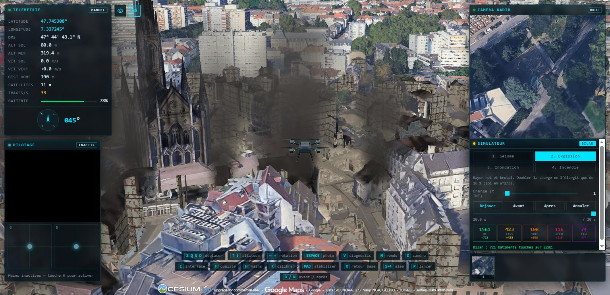

https://github.com/user-attachments/assets/9abfcd15-ab88-4252-bcb3-071d72b7d9c1

La visite guidée, 3 minutes, enregistrée sur une GTX 1650 de portable
([fichier de la vidéo en pleine qualité](docs/video/visite-guidee.mp4)).

Un drone survole le centre réel de Mulhouse, autour de la place de la Réunion :
2 282 bâtiments reconstitués depuis les données de l'IGN, posés sur le relief et
la photographie aérienne. On le pilote aux gestes devant une webcam, on
photographie le sol à la verticale, et un détecteur classe chaque bâtiment
endommagé — fissuré, partiellement effondré, effondré ou incendié — avec ses
scores de confiance.

Un simulateur rejoue séismes, explosions, inondations et incendies sur ces
bâtiments réels, en tenant compte de leur âge, de leur usage et du matériau de
leurs murs, et les montre se produire : l'eau qui monte, la boule de feu et
l'onde de choc, les flammes et la fumée, la poussière des effondrements.

Le tout tourne dans le navigateur, sans serveur ni clé d'API.

## Contexte

Ce projet est mené en collaboration avec un doctorant de
l'[Université de Haute-Alsace](https://www.uha.fr), à Mulhouse, qui y développe
les algorithmes destinés à le perfectionner.

L'objectif à terme est de sortir de la simulation : transposer ce travail sur de
vrais drones, pour aider les équipes de secours à évaluer rapidement les dégâts
après une catastrophe.

Le code s'y prête : chaque brique — détection, pilotage, simulation — est isolée
derrière une interface remplaçable, de sorte qu'un algorithme issu de ces
travaux peut s'y substituer sans toucher au reste.

## Fonctionnalités

- **Ville réelle** — 2 282 bâtiments de la BD TOPO® extrudés depuis leur contour
  exact, relief RGE ALTI®, photographie aérienne BD ORTHO® ; façades et toitures
  dessinées d'après l'époque, l'usage et la couverture que déclare l'IGN —
  volets, balcons, vitrines, tuiles, ardoises, terrasses — ; rendus réaliste,
  fil de fer et scan.
- **N'importe quelle ville** — le bouton du lieu cherche une ville ou une
  adresse ; bâtiments et relief se téléchargent au démarrage, depuis l'IGN en
  France et depuis OpenStreetMap et des tuiles d'altitude mondiales ailleurs, et
  le relevé photoréaliste se cale de lui-même sur le relief.
- **Ville photoréaliste**, avec un jeton Cesium ion gratuit — le relevé 3D de
  Google, celui de Google Earth, posé sur le relief de l'IGN. Les bâtiments
  effondrés y sont effacés et remplacés par leur ruine — tas de gravats, pans de
  murs cassés, murs mitoyens des voisins mis à nu, poussière alentour —, les
  bâtiments incendiés noircis ; la simulation reste sur les données de l'IGN.
- **Drone d'inspection** à la taille réelle — bras en carbone, hélices vrillées
  qui tournent, nacelle de caméra, patins, feux de navigation —, généré par le
  code en glTF.
- **Collisions et atterrissage** — bâtiments et ruines sont solides : le drone
  bute contre une façade et glisse le long du mur ; il se pose au sol, sur un
  toit ou sur les gravats d'un bâtiment effondré, à la surface même qui est
  dessinée.
- **Pilotage gestuel** — image de la webcam traitée par OpenCV (mesure et
  correction de l'éclairage, retour vidéo avec la commande reconnue), mains
  repérées par MediaPipe, disposition Mode 2
  des radiocommandes, gestes pour la photo et la bascule de vue.
- **Instrumentation** — coordonnées GPS en haut à gauche, caméra verticale en
  haut à droite, captures en PNG datées, vues embarquée et de suivi.
- **Diagnostic** — classification des dommages avec boîtes, scores et rapport ;
  précision et rappel calculés en direct contre la vérité terrain.
- **Simulateur de désastres** — quatre aléas physiquement fondés, une courbe de
  fragilité commune, une chronologie rejouable et parcourable dans les deux sens.
  On peut aussi choisir les bâtiments à la souris et leur donner un état, de
  fissuré à effondré, ou incendié, puis enregistrer le scénario en JSON pour le
  recharger ou le partager.
- **Export d'un jeu de données** — touche `J` : le drone balaie seul la zone
  pour chaque aléa et enregistre un millier d'images verticales annotées, aux
  formats YOLO et COCO, prêtes pour entraîner un détecteur. `Maj+J` lance une
  campagne variée : seize scénarios, images centrées sur les dégâts, hauteur et
  cap tirés au hasard.
- **Détecteur entraîné** — touche `O` : un modèle YOLO entraîné sur ce jeu de
  données prend la place du détecteur simulé et analyse l'image nadir dans le
  navigateur, sur la carte graphique ; ses alertes sont confrontées en direct à
  la vérité du simulateur.
- **Effets visibles** — crue qui monte et remplit les creux du relief, explosion
  (éclair, boule de feu, onde de choc, débris, colonne de fumée), incendies,
  poussière des effondrements, secousse du séisme.
- **Qualité adaptée à la machine** — profil choisi d'après la carte graphique
  (définition, ciel et brume, anticrénelage), puis cadence tenue en vol.

## Démarrage rapide

Prérequis : [Node.js](https://nodejs.org) 20 ou plus récent, et un navigateur
récent avec WebGL 2.

```bash
git clone https://github.com/Moundirhzr2/drone-recon.git
cd drone-recon
npm install
npm run dev
```

L'application s'ouvre sur <http://localhost:5173>. Aucune clé n'est nécessaire :
les bâtiments et le relief sont livrés avec le dépôt, et la photographie aérienne
vient des services publics de l'IGN.

Sous Windows, un double clic sur `lancer-drone.cmd` fait la même chose : il
installe les dépendances la première fois, démarre le serveur et ouvre le
navigateur. Fermer sa fenêtre arrête le simulateur.

Pour la ville photoréaliste : créer un compte gratuit sur
[Cesium ion](https://ion.cesium.com), ajouter « Google Photorealistic 3D Tiles »
à ses ressources depuis l'Asset Depot, puis copier le jeton dans un fichier
`.env.local` à la racine (voir `.env.example`). Git ignore ce fichier. Pour
revenir à la ville dessinée, ajouter `?ville=dessinee` à l'adresse.

Pour voler ailleurs qu'à Mulhouse : le bouton du lieu, en haut à gauche,
cherche une ville, une adresse, ou des coordonnées. Le simulateur se recharge sur
ce lieu et télécharge lui-même ses bâtiments et son relief : depuis l'IGN en
France, depuis OpenStreetMap ailleurs (voir
[une autre ville](docs/donnees.md#une-autre-ville)). L'adresse de la page le
retient : `?lieu=Berlin`.

Le profil de qualité est choisi d'après la carte graphique. Pour l'imposer,
ajouter `?qualite=fluide`, `?qualite=equilibre` ou `?qualite=beau` à l'adresse.

Pour une visite guidée de trois minutes — la ville réelle, puis les quatre
aléas —, ouvrir <http://localhost:5173/?demo>. N'importe quelle touche
l'interrompt et rend les commandes.

Pour piloter aux mains, appuyer sur `H`, autoriser la webcam, puis garder les deux
mains ouvertes et immobiles pendant les trois secondes de calibrage.

## Commandes

| Touche           | Effet                                                     |
| ---------------- | --------------------------------------------------------- |
| `Z` `Q` `S` `D`  | avancer, reculer, translater (`W` `A` `S` `D` en QWERTY)  |
| `↑` `↓`          | monter, descendre                                         |
| `←` `→`          | pivoter                                                   |
| `Espace`         | capture : vue du drone et photo nadir, en PNG datés       |
| `Maj` + `Espace` | capturer la paire avant / après du sinistre en cours      |
| `V`              | basculer entre vue brute et vue diagnostique              |
| `M`              | changer de rendu : réaliste, fil de fer, scan             |
| `C`              | vue embarquée ou caméra de suivi                          |
| `I`              | masquer ou afficher l'interface (aussi par son bouton)    |
| `F`              | rétablir la qualité d'image et la fixer (bouton HD)       |
| `H` / `K`        | activer le pilotage gestuel / le recalibrer               |
| `Maj`            | stabiliser le drone                                       |
| `R`              | retour au point de décollage                              |
| `1` à `4`        | choisir un aléa : séisme, explosion, inondation, incendie |
| `P`              | lancer ou mettre en pause le sinistre                     |
| `B` / `N`        | sauter avant / après le sinistre                          |
| `Retour arrière` | annuler le sinistre                                       |
| `E`              | choisir des bâtiments à endommager (clic, `Maj` + clic)   |
| `J`              | exporter un jeu de données annoté (Chrome ou Edge)        |
| `Maj` + `J`      | exporter la campagne variée                               |
| `O`              | passer au détecteur entraîné, ou revenir au simulé        |

Aux mains : la main gauche règle l'altitude et la rotation, la main droite le
déplacement ; un pincement droit prend une capture, un pincement gauche bascule
le diagnostic, deux poings fermés stabilisent le drone. Le détail est dans
[pilotage gestuel](docs/pilotage-gestuel.md).

## Collisions et atterrissage

Bâtiments et ruines sont solides. Une façade arrête le drone, qui glisse le long
du mur s'il l'aborde de biais ; un message signale le contact. Une marche basse —
le bord d'un tas de gravats, un éclat au sol — se franchit : le drone s'élève
au-dessus.

Pour se poser, il suffit de descendre jusqu'au contact (`↓`, ou main gauche
vers le bas) : au sol, sur un toit, ou sur les gravats d'une ruine. Dans les
derniers mètres, la descente ralentit d'elle-même. Posé, le drone coupe ses
moteurs : l'étiquette de la télémétrie passe à `POSÉ`, les hélices s'arrêtent,
et la ligne `SOUS DRONE`, hauteur au-dessus de ce qui est dessous, tombe à zéro.
Remettre les gaz (`↑`, ou main gauche vers le haut) le fait redécoller.

Pour survoler puis se poser sur des débris : lancer un sinistre, ou poser des
dégâts à la main (`E`), descendre au-dessus d'un bâtiment effondré, et se poser
sur le tas. Le drone s'y pose sur la surface même qui est dessinée : le rendu et
les collisions lisent la forme des ruines dans le même code.

## Captures

`Espace`, ou un pincement de la main droite, enregistre deux images PNG :

- `capture_2026-10-04_18-37-12_vue.png` : la vue du pilote, telle qu'à l'écran,
  sans l'interface ;
- `capture_2026-10-04_18-37-12_nadir.png` : la photo verticale de la caméra
  nadir, qui rejoint aussi la galerie avec ses détections.

`Maj` + `Espace`, ou le bouton « Capturer avant / après » du simulateur, prend
la paire avant / après du sinistre en cours, depuis le même point de vue : le
drone se fige, la scène revient avant le sinistre, puis passe à son état final.
Trois fichiers : `_avant.png`, `_apres.png`, et `_avant-apres.png` où les deux
sont côte à côte.

Chaque image porte un bandeau : date et heure, position, hauteur au-dessus du
sol, cap, et la source des données affichées. Un éclair et un message
confirment l'enregistrement.

À la première capture faite au clavier, Chrome et Edge demandent dans quel
dossier enregistrer ; les suivantes s'y écrivent sans question. Ailleurs, ou si
l'on refuse, les images partent dans les téléchargements. Un pincement de la
main ne peut pas ouvrir ce choix (le navigateur l'exige d'une action au clavier
ou à la souris) : tant qu'aucun dossier n'est choisi, il télécharge.

## Aperçu

<table>
  <tr>
    <td width="50%">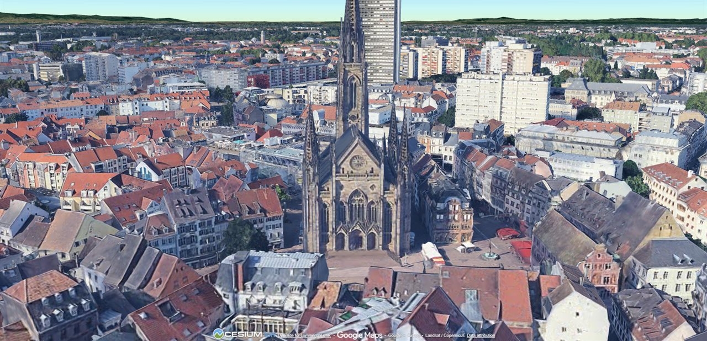</td>
    <td width="50%">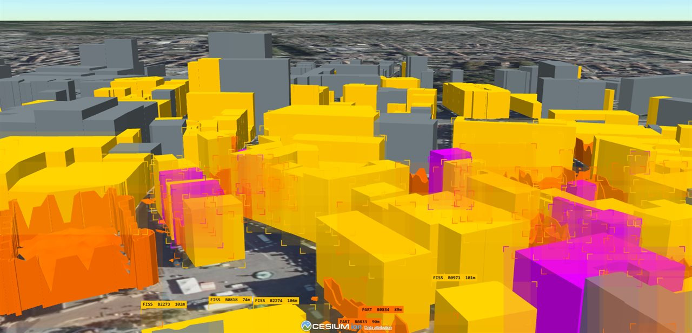</td>
  </tr>
  <tr>
    <td align="center"><sub>Place de la Réunion : le relevé 3D de Google sur le relief de l'IGN</sub></td>
    <td align="center"><sub>Diagnostic : chaque bâtiment classé, identifié et situé</sub></td>
  </tr>
  <tr>
    <td>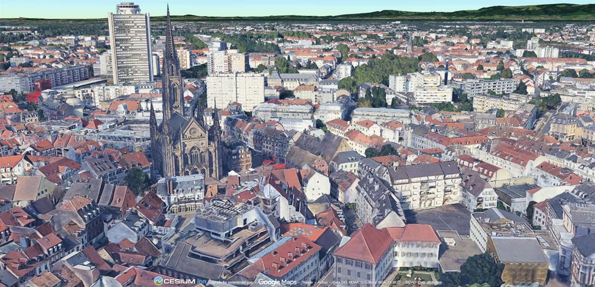</td>
    <td>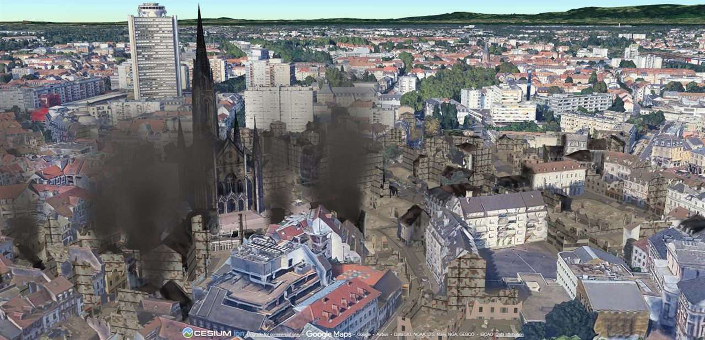</td>
  </tr>
  <tr>
    <td align="center"><sub>Avant une explosion d'une tonne de TNT…</sub></td>
    <td align="center"><sub>…et après, même cadrage : ruines et carcasses calcinées</sub></td>
  </tr>
  <tr>
    <td>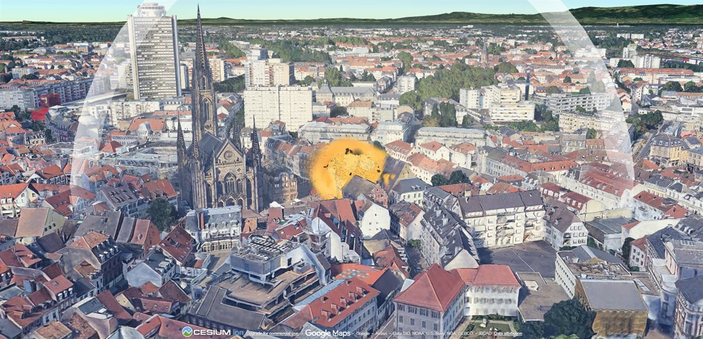</td>
    <td>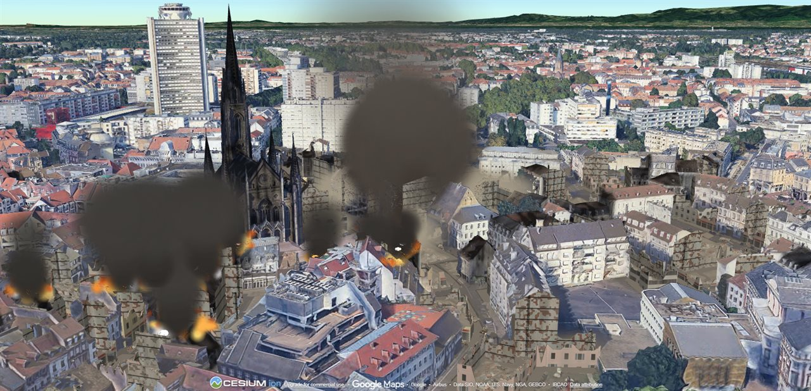</td>
  </tr>
  <tr>
    <td align="center"><sub>L'explosion : boule de feu et dôme de l'onde de choc</sub></td>
    <td align="center"><sub>Deux secondes plus tard : nuage, débris, premiers feux</sub></td>
  </tr>
  <tr>
    <td>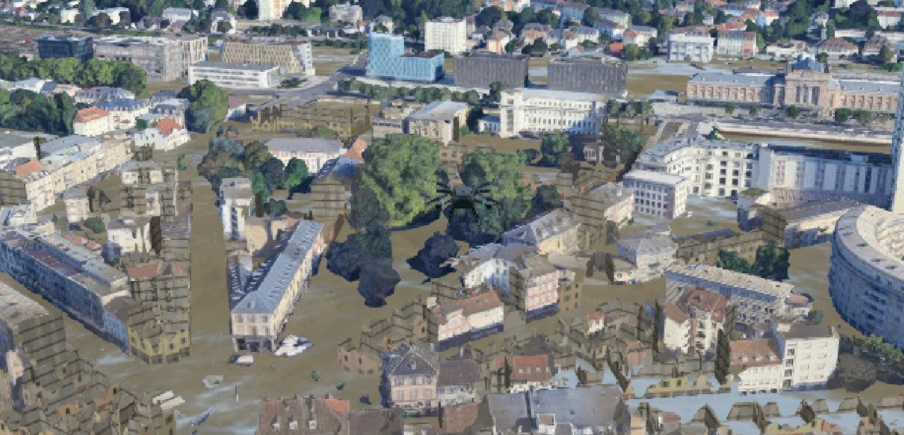</td>
    <td>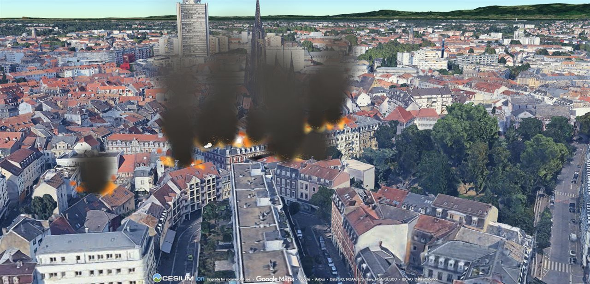</td>
  </tr>
  <tr>
    <td align="center"><sub>Inondation : l'eau monte à niveau plat et remplit les points bas (relevé 3D : Google)</sub></td>
    <td align="center"><sub>Incendie poussé par le vent de sud-ouest</sub></td>
  </tr>
  <tr>
    <td>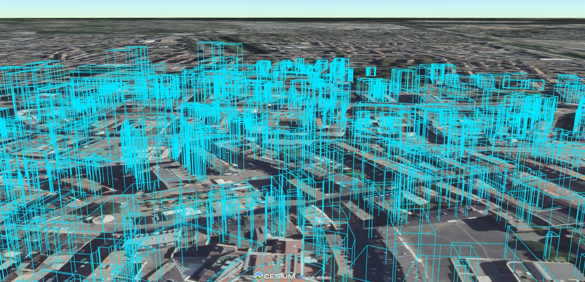</td>
    <td>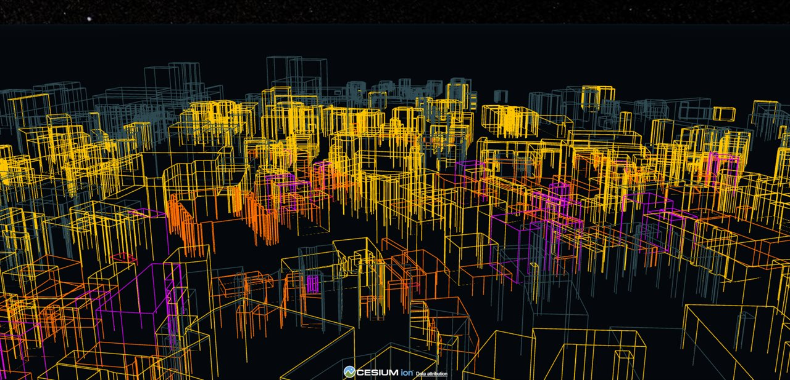</td>
  </tr>
  <tr>
    <td align="center"><sub>Fil de fer : les contours de l'IGN sur la photo aérienne</sub></td>
    <td align="center"><sub>Scan : la classification seule</sub></td>
  </tr>
</table>

## Comment ça marche

**Un bâtiment cède quand l'intensité qu'il subit croise sa vulnérabilité.** Chaque
bâtiment a une vulnérabilité tirée de ses attributs IGN — année de construction,
usage, matériau des murs — et de son élancement.
Chaque aléa produit un champ d'intensité selon sa propre physique — atténuation
macrosismique, loi de Hopkinson-Cranz calée sur les abaques de Kingery-Bulmash,
hauteur d'eau, propagation du feu sous le vent. Une courbe de fragilité unique
convertit les deux en état de dommage.

**Le détecteur a la forme d'un vrai détecteur, sans en être un.** Il lit la
vérité terrain et la restitue en boîtes, classes et scores bruités de façon
réaliste. On peut donc mesurer sa précision en direct, et le remplacer par un
modèle réel sans rien changer en aval.

**Un sinistre est calculé d'avance.** La chronologie complète est construite
avant la première image : elle est rejouable à l'identique, parcourable en
arrière, et son bilan est connu immédiatement. Les effets visuels suivent le
temps de cette chronologie, pas l'horloge : revenir en arrière fait redescendre
l'eau.

## Documentation

| Document                                         | Contenu                                                                                                       |
| ------------------------------------------------ | ------------------------------------------------------------------------------------------------------------- |
| [Données](docs/donnees.md)                       | sources IGN, traitements, corrections, licence                                                                |
| [Architecture](docs/architecture.md)             | organisation du code, boucle de rendu, repère local de Cesium, textures                                       |
| [Simulateur de désastres](docs/simulateur.md)    | courbe de fragilité, physique, calage et effets des quatre aléas ; dégâts posés à la main ; scénarios en JSON |
| [Diagnostic](docs/diagnostic.md)                 | fonctionnement du détecteur, métriques, fonds de scène                                                        |
| [Jeu de données](docs/jeu-de-donnees.md)         | balayage automatique, formats YOLO et COCO, classes, limites                                                  |
| [Détecteur entraîné](docs/detecteur-entraine.md) | entraînement, export ONNX, exécution dans le navigateur, résultats, autre modèle                              |
| [Pilotage gestuel](docs/pilotage-gestuel.md)     | gestes, choix des deux mains, réglage de la réactivité                                                        |
| [Performance](docs/performance.md)               | profils de qualité, mesures, pièges de Cesium                                                                 |

## Limites connues

- **Le détecteur entraîné n'a vu que des images de synthèse.** Il a appris sur
  la ville dessinée, entre 40 et 90 m de hauteur : il reste à le valider sur de
  vraies images de drone. Il ne distingue pas un bâtiment fissuré, que ce
  rendu dessine comme un intact. Le détecteur par défaut, lui, est simulé : il
  n'analyse pas l'image, il bruite la vérité terrain.
- **Dans la ville dessinée, les toits sont plats.** Chaque bâtiment est une
  extrusion de son contour : la couverture de son toit est dessinée d'après
  l'IGN, mais pas sa pente, ni la flèche du temple Saint-Étienne. La ville
  photoréaliste, elle, a les vrais toits.
- **Dans la ville photoréaliste, les ruines restent dessinées.** Le relevé de
  Google est une peau d'un seul tenant : un bâtiment effondré y est effacé et
  remplacé par une ruine calculée, moins fine que le relevé qui l'entoure. Le
  relevé déborde parfois du contour IGN : il en reste de loin en loin un bord
  de toit voisin au-dessus d'un mur mitoyen. Des fissures ne s'y voient pas. Il
  faut aussi une connexion Internet, et la ville est celle de la date des
  prises de vue de Google.
- **Seuls les bâtiments sont solides.** Arbres, lampadaires et fumée ne gênent
  pas le vol. Dans la ville photoréaliste, les collisions suivent les contours
  de l'IGN et non le relevé de Google : à un ou deux mètres près, le drone peut
  buter avant une façade du relevé, ou en frôler une.
- **Le séisme triche sur l'échelle.** Sa profondeur focale est ramenée à 220 m
  pour que le gradient soit visible à l'échelle du quartier ; un vrai foyer
  frapperait la zone de façon uniforme.
- **La crue suit le modèle « de la baignoire ».** L'eau monte à niveau plat sur le
  relief réel, sans tenir compte de la connectivité des creux ni de
  l'écoulement : c'est le bon ordre de grandeur pour une crue lente de plaine.
- **Le temps est comprimé.** Un incendie de quartier se joue en une minute et
  demie ; les flammes durent un quart de minute au lieu de plusieurs heures.
- **La secousse est une convention.** Un drone en vol ne ressent pas un séisme ;
  la caméra tremble pour que l'écran dise que le sol tremble.
- **Le suivi des mains dépend de l'éclairage** et n'a été éprouvé que sur un petit
  nombre de configurations.
- **L'imagerie Esri**, utilisée hors de France, convient à un usage personnel ; un
  déploiement public demanderait une source sous contrat.

## Développement

```bash
npm run dev           # serveur de développement
npm run verify        # formatage, lint, types et build : ce que vérifie la CI
npm run lint:fix      # corriger ce que le linter sait corriger
npm run format        # formater le code
npm run data          # retélécharger bâtiments et relief depuis l'IGN
```

Les réglages — performance, drone, caméra nadir, détecteur, mains — sont
regroupés et commentés dans [`src/core/config.ts`](src/core/config.ts) ; ceux des
profils de qualité dans [`src/world/quality.ts`](src/world/quality.ts).

Voir [CONTRIBUTING.md](CONTRIBUTING.md) pour les conventions du projet.

## Technologies

[CesiumJS](https://cesium.com/platform/cesiumjs/) pour le globe, le rendu 3D et
les particules,
[OpenCV](https://opencv.org) (opencv.js) pour le traitement de l'image de la
webcam,
[MediaPipe Hand Landmarker](https://ai.google.dev/edge/mediapipe/solutions/vision/hand_landmarker)
pour le repérage des mains, [earcut](https://github.com/mapbox/earcut) pour les
toitures, [TypeScript](https://www.typescriptlang.org) et [Vite](https://vite.dev).
Le détecteur est entraîné avec [PyTorch](https://pytorch.org) et
[Ultralytics YOLO](https://docs.ultralytics.com), puis exécuté dans le navigateur
par [ONNX Runtime Web](https://onnxruntime.ai).

Données : © IGN — BD TOPO®, RGE ALTI®, BD ORTHO® — Licence Ouverte Etalab 2.0.
Imagerie hors de France : Esri, Maxar, Earthstar Geographics.

## Licence

[MIT](LICENSE) © Moundir Houazar
