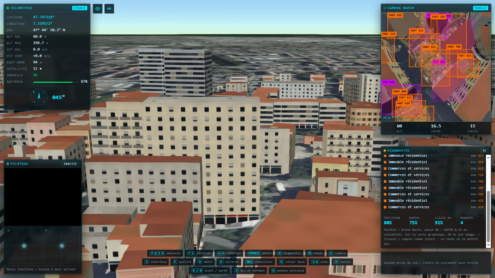

# Détecteur entraîné



La touche `O` remplace le [détecteur simulé](diagnostic.md) par un vrai modèle
de vision : un YOLO entraîné sur les images que le simulateur exporte, exécuté
dans le navigateur sur l'image de la caméra nadir. Un second appui revient au
détecteur simulé.

Le rapport de diagnostic reste le même, et c'est tout l'intérêt : la précision
et le rappel affichés en vol sont désormais ceux d'un vrai modèle, mesurés en
direct contre la vérité du simulateur.

Le modèle en est à sa deuxième version. La première, entraînée sur le
quadrillage, a montré trois faiblesses ; la seconde y répond par les données,
avec le même modèle de départ et les mêmes réglages, à la taille des lots
près.

## La chaîne complète

| Étape              | Outil                                                            | Ce qu'elle produit                                       |
| ------------------ | ---------------------------------------------------------------- | -------------------------------------------------------- |
| 1. Images annotées | touches `J` et `Maj+J`, voir [jeu de données](jeu-de-donnees.md) | images de 640 px et leurs annotations                    |
| 2. Préparation     | `ml/preparer.py`                                                 | séparation entraînement / validation, classes fusionnées |
| 3. Entraînement    | `ml/entrainer.py`                                                | YOLO11n entraîné sur la carte graphique                  |
| 4. Mesure          | `ml/evaluer.py`                                                  | scores au réglage du simulateur, matrice de confusion    |
| 5. Export          | `ml/exporter.py`                                                 | `public/models/detecteur.onnx` (10,6 Mo) et sa fiche     |
| 6. Exécution       | `src/diagnostic/model.ts`                                        | le modèle dans le navigateur, touche `O`                 |

Les commandes sont dans la [notice de `ml/`](../ml/README.md).

La validation est toujours séparée **par emplacement**, jamais par image :
mélanger les images d'une même rue entre entraînement et validation ferait
valider le modèle sur des rues qu'il a déjà vues. La classe « fissuré » est
fusionnée avec « intact » : quand ces jeux ont été produits, un bâtiment
fissuré était rendu exactement comme un intact, et demander au modèle de les
distinguer serait revenu à lui apprendre à deviner. Les fissures sont
dessinées depuis (voir [simulateur](simulateur.md#ce-quon-voit)) : un nouveau
jeu de données permettrait d'entraîner cette classe.

Le modèle est YOLO11n, le plus petit des modèles YOLO récents (2,6 millions de
paramètres), parti de poids préentraînés sur COCO. Il tient dans les 4 Go
d'une GTX 1650 et tourne ensuite dans un navigateur. La demi-précision est
coupée : elle donne des pertes NaN sur les cartes GTX 16xx. Les images étant
prises à la verticale, le retournement haut-bas s'ajoute au gauche-droite
parmi les augmentations.

## Version 1 : le quadrillage

Entraînée sur les 1 044 images du quadrillage (touche `J`) : quatre sinistres
joués avec leurs réglages par défaut, photographiés à 60 m, nord en haut. Une
case du quadrillage sur cinq part en validation, avec ses quatre images.

|              | Images | Intact | Partiel | Effondré | Incendié |
| ------------ | -----: | -----: | ------: | -------: | -------: |
| Entraînement |    836 |  6 386 |     256 |      105 |      115 |
| Validation   |    208 |  1 335 |      55 |       27 |       49 |

60 passes par lots de 16, en un peu moins de deux heures ; poids retenus à la
passe 48. Sur ses 208 images de validation : **mAP50 0,71**, mAP50-95 0,50.

Au réglage du simulateur (voir plus bas), 73 % de ses alertes sont justes et il
signale 69 % des dégâts. Trois faiblesses ressortent :

- **L'effondrement** : 8 sur 27 seulement. Quand le modèle annonce un
  effondrement, il a raison, mais il en manque 14 et en prend 5 pour des
  effondrements partiels. C'était la classe la moins représentée : 105
  exemples à l'entraînement.
- **Une seule hauteur, un seul cap** : toutes ses images sont prises à 60 m,
  nord en haut.
- **Peu de dégâts** : un bâtiment annoté sur quatorze, et une validation trop
  petite pour mesurer finement l'effondrement.

## Version 2 : la campagne variée

Les trois faiblesses viennent des données, et le simulateur peut en produire
autant qu'il en faut. La [campagne variée](jeu-de-donnees.md#la-campagne-variée-majj)
(`Maj+J`) rejoue chaque aléa quatre fois, avec d'autres foyers, intensités et
tirages, et centre la plupart des images sur des dégâts, les effondrés plus
souvent que les autres, entre 40 et 90 m et dans toutes les directions :
2 202 images, 39 514 bâtiments annotés.

Les images se recouvrent : la séparation se fait par **zones de 250 m**. Une
zone sur cinq part en validation, prises à intervalle régulier dans l'ordre des
plus touchées ; une image à cheval sur une zone de validation et une zone
d'entraînement est écartée.

|              | Images | Intact | Partiel | Effondré | Incendié |
| ------------ | -----: | -----: | ------: | -------: | -------: |
| Entraînement |  1 370 | 11 798 |   6 219 |    3 198 |    3 840 |
| Validation   |    456 |  2 434 |   1 064 |      975 |    2 089 |
| Écartées     |    376 |        |         |          |          |

L'entraînement reprend exactement le modèle de départ et les réglages de la
version 1. Seule la taille des lots passe de 16 à 8 images : ces images
contiennent trois fois plus de bâtiments, et le calcul de la perte dépassait
les 4 Go de la carte. Ultralytics accumule les gradients jusqu'à 64 images,
si bien que le pas d'apprentissage effectif ne change pas. 60 passes en 1 h 18 ;
le score progressait encore à la dernière.

### Avant / après, sur la même validation

Les deux versions sont mesurées sur les 456 images de validation de la
campagne variée, avec les mêmes outils.

| mAP50 (Ultralytics) | Version 1 | Version 2 |
| ------------------- | --------: | --------: |
| Intact              |      0,86 |      0,91 |
| Partiel             |      0,71 |      0,87 |
| Effondré            |      0,34 |  **0,79** |
| Incendié            |      0,74 |      0,89 |
| **Ensemble**        |      0,66 |  **0,87** |
| mAP50-95            |      0,42 |      0,66 |

Au réglage du simulateur, comme dans le rapport en vol :

| Mesure                                 | Version 1 | Version 2 |
| -------------------------------------- | --------: | --------: |
| Alertes justes (précision)             |      78 % |  **86 %** |
| Dégâts signalés (rappel)               |      62 % |  **83 %** |
| Bonne classe, parmi les dégâts trouvés |      96 % |      99 % |
| Effondrés trouvés                      |      32 % |  **72 %** |
| Partiels trouvés                       |      68 % |      86 % |
| Incendiés trouvés                      |      68 % |      85 % |

Et par hauteur de vol, précision puis rappel des alertes :

| Hauteur |   Version 1 |   Version 2 |
| ------- | ----------: | ----------: |
| 40–54 m | 69 % / 65 % | 82 % / 80 % |
| 55–69 m | 79 % / 67 % | 86 % / 83 % |
| 70–90 m | 80 % / 58 % | 87 % / 84 % |

La version 1 perdait de la précision en bas et du rappel en haut, loin des
60 m qu'elle connaissait. La version 2 tient sur toute la plage.

Cette comparaison avantage plutôt la version 1 : 168 de ses 836 images
d'entraînement sont centrées dans les zones de validation de la version 2. Elle
avait donc déjà vu une partie de ces rues, sous les sinistres par défaut. Le
gain mesuré est un minimum.

### Matrice de confusion de la version 2

| Prédit \ réel |    Intact | Partiel | Effondré |  Incendié | Rien |
| ------------- | --------: | ------: | -------: | --------: | ---: |
| Intact        | **2 133** |       1 |        0 |         0 |  444 |
| Partiel       |         1 | **914** |       20 |         0 |  159 |
| Effondré      |         0 |       5 |  **706** |         1 |  127 |
| Incendié      |         2 |       1 |        0 | **1 778** |  282 |
| Rien          |       298 |     143 |      249 |       310 |      |

- **Un dégât n'est presque jamais pris pour un bâtiment intact**, et les
  classes de dégâts ne se confondent presque plus entre elles : 99 % des
  dégâts trouvés reçoivent la bonne classe.
- **L'effondrement reste le plus difficile** : 249 effondrés sur 975 ne sont
  pas trouvés. Mais il passe d'un sur trois à près de trois sur quatre.
- **Les fausses alertes sont surtout des erreurs de cadrage** : 412 des 571
  recouvrent bien un bâtiment, mais à moins de 50 %. Comme dans le calcul du
  mAP50, une telle boîte compte comme fausse. En vol, le rapport nomme quand
  même le bâtiment visé, suivi de « boîte imprécise ».

## Comment le simulateur compte

Le mAP balaie tous les seuils de confiance ; en vol, le simulateur ne garde que
les boîtes au-dessus de 30 %. `ml/evaluer.py` refait sur la validation
exactement le calcul du simulateur : même seuil, fusion des boîtes sans tenir
compte de la classe, rapprochement d'une boîte et d'un bâtiment à partir de
50 % de recouvrement. Une alerte est une boîte d'une classe de dégâts : juste
si elle tombe sur un bâtiment réellement endommagé, fausse sinon.

## Dans le navigateur

### Exécution

Le modèle exporté en ONNX tourne avec
[ONNX Runtime Web](https://onnxruntime.ai), dans un worker : son calcul ne
bloque jamais la boucle de rendu. Il passe par la carte graphique (WebGPU)
quand elle est disponible, en demandant la plus puissante sur un portable qui
en a deux, et sinon par le processeur (WebAssembly).

| Mesure, GTX 1650 Max-Q                     | Valeur                                                                  |
| ------------------------------------------ | ----------------------------------------------------------------------- |
| Une analyse, carte graphique (WebGPU)      | 45 à 90 ms selon la charge de la carte, préparation de l'image comprise |
| Une analyse, processeur seul (WebAssembly) | 3 à 5 s                                                                 |
| Cadence de la 3D, modèle actif ou non      | 57 images/s dans les deux cas (Chrome sans fenêtre, drone immobile)     |

Le modèle reçoit l'image de la passe de rendu nadir, recopiée à 640 px : il
n'y a pas de rendu en plus. Une image ne lui est envoyée que s'il a fini la
précédente, au plus quatre fois par seconde, au rythme de la caméra nadir.

Le moteur WebAssembly (27 Mo) et le modèle (10,6 Mo) ne sont téléchargés qu'au
premier appui sur `O`.

### Ce que voit le modèle

Il voit la scène comme à l'entraînement : la ville dessinée d'après l'IGN,
sans fumée, flammes ni eau, et sans les couleurs de la vue diagnostique, qui
lui souffleraient la réponse. La touche `O` bascule donc la vue dans ce rendu.
Le relevé photoréaliste de Google n'est jamais analysé : ses conditions
d'utilisation l'interdisent, et le modèle n'a jamais vu ces images.

### Vérifications

- **Décodage.** Sur une même image, le navigateur et Ultralytics trouvent les
  mêmes 24 boîtes, avec les mêmes classes et les mêmes scores.
- **En vol.** Au-dessus d'un même foyer de dégâts, à 60 m et à 0°, 45° et 90°
  de cap, la version 2 signale 83 à 89 % des dégâts, contre 67 à 75 % pour la
  version 1, avec 89 à 100 % d'alertes justes. Un seul lieu ne prouve rien en
  général, mais il confirme la mesure sur la validation.

## Limites

- **Images de synthèse.** Le modèle n'a vu que la ville dessinée. Il reste à
  le mesurer sur de vraies images de drone, où l'écart entre simulation et
  réalité sera la vraie question.
- **Des sinistres déjà vus.** La validation sépare les rues, pas les
  scénarios : ce sont les mêmes seize sinistres, ailleurs dans la ville. Un
  sinistre jamais vu reste à tester.
- **Entre 40 et 90 m.** Au-delà de 15 m hors de cette plage, le rapport
  signale que les bâtiments n'ont plus la taille que le modèle connaît.
- **Pas de fissures.** Le modèle a été entraîné avant qu'elles soient
  dessinées : il ne les cherche pas, et le rapport les compte comme intactes.
- **Un léger retard.** Les boîtes affichées sont celles de la dernière analyse
  terminée, soit une fraction de seconde de retard sur l'image.

## Brancher un autre modèle

Le simulateur ne connaît du modèle que deux fichiers, dans `public/models/` :
`detecteur.onnx` et sa fiche `detecteur.json`.

```json
{
  "name": "YOLO11n — Drone Recon v2",
  "format": "yolo",
  "inputSize": 640,
  "classes": ["intact", "partial", "collapsed", "burnt"],
  "trainedAltitudes": [40, 90],
  "epoch": 60,
  "validation": { "mAP50": 0.867, "mAP50-95": 0.663, "precision": 0.868, "recall": 0.798 }
}
```

- **Entrée** : une image carrée `[1, 3, taille, taille]`, en RVB, de 0 à 1.
- **Sortie au format `yolo`** : un tenseur `[1, 4 + classes, ancres]`, soit le
  centre et la taille de chaque boîte en pixels, puis un score par classe. C'est
  la sortie des modèles Ultralytics exportés sans post-traitement (`nms=False`).
- **Classes** : nommées comme les états du simulateur (`intact`, `cracked`,
  `partial`, `collapsed`, `burnt`), dans l'ordre des sorties du modèle.

Un autre détecteur à ce format se branche en remplaçant ces deux fichiers, sans
toucher au code. Un format de sortie différent demande seulement d'écrire son
décodage, sur le modèle de `src/diagnostic/yolo.ts` : le rapprochement avec la
vérité, l'affichage et les métriques ne changent pas.
