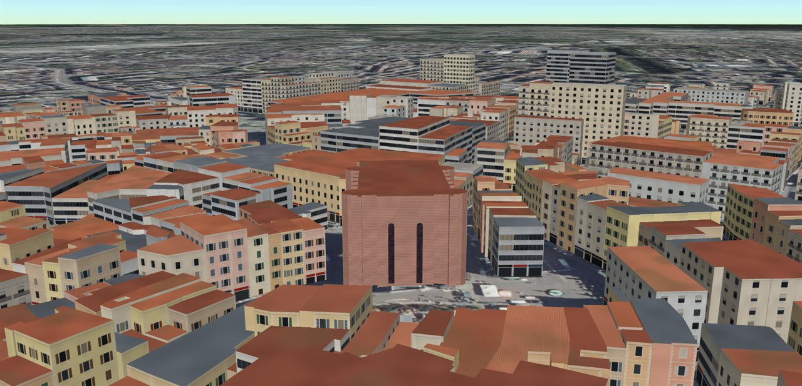

# Données

La ville du simulateur n'est pas inventée : par défaut, c'est le centre de
Mulhouse, autour de la place de la Réunion, reconstitué à partir de trois jeux
de données publics de l'[IGN](https://www.ign.fr), sous
[Licence Ouverte Etalab 2.0](https://www.etalab.gouv.fr/licence-ouverte-open-licence/).
N'importe quelle autre ville se charge au démarrage : depuis l'IGN en France,
depuis des sources mondiales ailleurs (voir [une autre ville](#une-autre-ville)).

| Donnée         | Produit IGN | Contenu                                                | Fichier                                 |
| -------------- | ----------- | ------------------------------------------------------ | --------------------------------------- |
| Bâtiments      | BD TOPO®    | 2 282 emprises, hauteurs, usages, matériaux, années    | `public/data/mulhouse-centre.json`      |
| Relief         | RGE ALTI®   | 121 × 121 altitudes au pas de 10 m, sur 1,2 km de côté | `public/data/mulhouse-relief.json`      |
| Photo aérienne | BD ORTHO®   | le sol vu du ciel, à 20 cm environ                     | chargée en ligne, service WMTS de l'IGN |



## Pourquoi des fichiers figés

Les bâtiments et le relief sont téléchargés **une fois**, puis versionnés dans le
dépôt. Deux raisons :

- le simulateur démarre sans réseau ni clé d'API ;
- surtout, une simulation de désastre n'est comparable d'une fois sur l'autre
  que si la ville ne change pas sous nos pieds.

Pour les régénérer, depuis les services publics de la Géoplateforme :

```bash
npm run data            # bâtiments puis relief
npm run data:buildings  # BD TOPO® seule
npm run data:relief     # RGE ALTI® seul
```

Les scripts sont dans [`scripts/`](../scripts). Ils interrogent les services par
pages (bâtiments) ou par lots de cent points (relief), avec une courte pause
entre deux requêtes pour ne pas surcharger un service public gratuit.

## Des attributs bruts à la vulnérabilité

Les fichiers gardent les attributs **tels que l'IGN les publie**. Toute
interprétation se fait dans le simulateur (`world/realCity.ts`), où elle est
documentée et peut évoluer sans retélécharger.

**Emprises.** Les contours sont convertis en mètres locaux autour du centre de la
zone, arrondis au décimètre : bien en deçà de la précision annoncée par l'IGN,
et deux fois plus léger qu'en degrés. Les éclats de moins de 4 m², artefacts de
découpage, sont écartés. Chaque bâtiment est extrudé depuis son contour exact —
un mur par arête — et son toit est triangulé avec
[earcut](https://github.com/mapbox/earcut), ce qui respecte les cours
intérieures.

**Hauteur.** L'IGN publie la hauteur à la gouttière et l'altitude du faîte. Nos
toits sont plats : on les place à mi-chemin, ce qui conserve à peu près le volume
d'un toit à deux pans.

**Année de construction.** Elle n'est connue que pour 1 061 bâtiments sur 2 282
(46 %). Pour les autres, on prend la médiane des six voisins datés les plus
proches, dans un rayon de 80 m : les bâtiments d'un même îlot ont presque
toujours été construits à la même époque.

**Matériau des murs.** C'est l'attribut qui compte le plus pour un séisme, et
l'IGN le fournit. Il module la vulnérabilité dans l'ordre de l'échelle EMS-98 :

| Matériau  | Coefficient |
| --------- | ----------- |
| pierre    | × 1,15      |
| meulière  | × 1,12      |
| brique    | × 1,05      |
| aggloméré | × 1,00      |
| bois      | × 0,85      |
| béton     | × 0,78      |

L'usage (logement, commerce, culte, annexe…) et le caractère léger de la
construction entrent aussi en compte. Le calcul complet est dans
`computeVulnerability` (`world/buildings.ts`).

**Toitures.** La BD TOPO® déclare le matériau de couverture — tuiles, ardoises,
métal, béton, verre — pour un bâtiment sur trois, et, par l'écart entre la
hauteur du faîte et celle de la gouttière, la forme du toit : 1 952 toits en
pente, 264 terrasses. Le rendu s'en sert pour dessiner chaque couverture ; quand
le matériau manque, une terrasse est en béton gravillonné et un toit en pente
en tuiles, parfois en ardoises.

## Corrections

Une seule hauteur est corrigée à la main : la **tour de l'Europe**, à qui la
BD TOPO® attribue 53 m alors qu'elle culmine vers 100 m (112 m antenne comprise).
C'est la seule erreur flagrante relevée dans la zone, et elle touche le bâtiment
le plus reconnaissable de la ville.

Le **temple Saint-Étienne** garde sa hauteur IGN. Sa flèche de 97 m est trop
fine pour être obtenue en extrudant l'emprise de tout l'édifice : le temple
apparaît comme une nef, en grès rose des Vosges.

## Une autre ville

Le bouton du lieu, en haut à gauche, cherche une ville, une adresse, ou des
coordonnées (« 48.58, 7.75 »). Choisir un résultat recharge le simulateur sur ce
lieu ; l'adresse de la page le retient (`?lieu=Strasbourg&lat=48.5818&lon=7.7509`),
et `?lieu=Strasbourg` seul fait la recherche au démarrage.

Le navigateur télécharge alors lui-même, depuis la Géoplateforme de l'IGN, ce
que les scripts préparent pour Mulhouse (`src/world/ignData.ts`) :

| Donnée         | Service         | Ce qui est chargé                                                  |
| -------------- | --------------- | ------------------------------------------------------------------ |
| Bâtiments      | WFS, BD TOPO®   | un carré de 900 m centré sur le lieu, par pages de mille           |
| Relief         | WMS, RGE ALTI®  | une image de 121 × 121 altitudes (flottants de 32 bits) sur 1,2 km |
| Photo aérienne | WMTS, BD ORTHO® | en ligne, comme pour Mulhouse                                      |

Le traitement des bâtiments est celui du script, et produit le même fichier : le
reste du simulateur ne voit pas la différence. Le relief tient en une seule
requête, là où le script interroge 14 641 points par lots de cent ; vérifié sur
Mulhouse, les deux grilles diffèrent de 1 cm en moyenne. Les données d'une
ville déjà visitée restent dans le cache du navigateur : y revenir est immédiat.

La recherche passe par le géocodeur de l'IGN, sauf quand la ville photoréaliste
est active : les conditions de Google n'autorisent avec ses tuiles que son
propre géocodeur, appelé alors au travers de Cesium ion. Google rend une
emprise, dont le centre devient le point de départ.

Ce qui reste propre à Mulhouse : la correction de la tour de l'Europe, ignorée
ailleurs, et la visite guidée (`?demo`). Le détecteur entraîné n'a vu que
Mulhouse ; il reconnaît la ville dessinée d'ailleurs, puisque le rendu est le
même, mais ses scores n'y ont pas été mesurés.

### Hors de France

Les services de l'IGN ne couvrent que la France. Quand leur relief ne couvre pas
toute la zone — hors de France, ou à cheval sur une frontière —, le simulateur
prend des sources mondiales :

| Donnée                | Source                                                                | Ce qui change par rapport à l'IGN                                                                                             |
| --------------------- | --------------------------------------------------------------------- | ----------------------------------------------------------------------------------------------------------------------------- |
| Bâtiments             | OpenStreetMap, par l'API Overpass (`osmData.ts`)                      | hauteur ou étages et usage souvent renseignés ; année et matériaux rarement                                                   |
| Bâtiments, en secours | OpenStreetMap en tuiles vectorielles OpenFreeMap (`tileBuildings.ts`) | hauteur seule, sans usage                                                                                                     |
| Relief                | tuiles Terrarium de Mapzen, sur AWS (`worldRelief.ts`)                | environ 30 m de résolution ; 1,9 m plus haut en moyenne que l'IGN à Mulhouse, car il mesure en partie les toits et les arbres |
| Photo aérienne        | Esri World Imagery                                                    | déjà le fond du globe hors de France                                                                                          |

Les étiquettes d'OpenStreetMap sont traduites dans le vocabulaire de la BD
TOPO® : `building=house` devient « Résidentiel », `church` « Religieux »,
`building:material=brick` le code « brique »… Le reste du simulateur ne voit
pas la différence. Comme pour l'IGN, une emprise de moins de 4 m² est écartée :
à Berlin, cela retire les 2 711 stèles du Mémorial aux Juifs assassinés
d'Europe, que la carte décrit chacune comme un bâtiment.

Overpass est un service gratuit, souvent saturé : passé quinze secondes, le
simulateur se rabat sur les tuiles d'OpenFreeMap, rapides mais pauvres en
attributs. Hors de France, l'export d'un jeu de données (`J`) est refusé : la
photographie aérienne d'Esri ne peut pas en être extraite, pas plus que le
relevé de Google.

Pour la recherche, Photon (fondé sur OpenStreetMap) complète l'IGN pour
l'étranger ; sur la ville photoréaliste, Google couvre déjà le monde.

## Altitudes

Les altitudes de l'IGN sont mesurées au-dessus du niveau de la mer, pas
au-dessus de l'ellipsoïde WGS84 qu'emploie Cesium. L'écart est d'environ 49 m en
Alsace. Il est sans conséquence tant que le terrain, les bâtiments et le drone
partagent la même référence, ce qui est le cas en mode hors-ligne. Les modes
`ion` et `google` apportent leur propre terrain et n'utilisent pas ce relief.

Le relevé photoréaliste de Google, lui, est en hauteurs au-dessus de
l'ellipsoïde : il est abaissé de cet écart pour se poser sur le relief de
l'IGN. À Mulhouse, l'écart a été mesuré à la main : 48,2 m. Ailleurs, il est
mesuré au chargement (`PhotorealCity.calibrate`) : la hauteur du relevé en une
soixantaine de points dégagés, comparée au relief. Arbres, voitures et toits ne
peuvent que rehausser un point ; on retient donc le groupe de points le plus
dense, sur 2 m, et sa médiane. Appliquée à Mulhouse, la mesure donne 48,15 m ;
à Strasbourg, 47,9 m. Hors de France, c'est sur le relief mondial que le relevé
se cale : à Berlin, 31,2 m, la hauteur du géoïde (environ 39 m) moins le biais
de ce relief, plus haut que le sol en ville.

## État de départ

La ville démarre intacte, telle que la décrit la BD TOPO® : aucun bâtiment
n'est endommagé au chargement. Les dégâts ne viennent que du
[simulateur de désastres](simulateur.md), lancé par l'utilisateur.

## Attribution

À reproduire avec toute image ou donnée issue du simulateur :

> © IGN — BD TOPO®, RGE ALTI®, BD ORTHO® — Licence Ouverte Etalab 2.0

Hors de la France, le sol vient d'Esri World Imagery (Esri, Maxar, Earthstar
Geographics), qui convient à un usage personnel ; un déploiement public
demanderait une source sous contrat.
