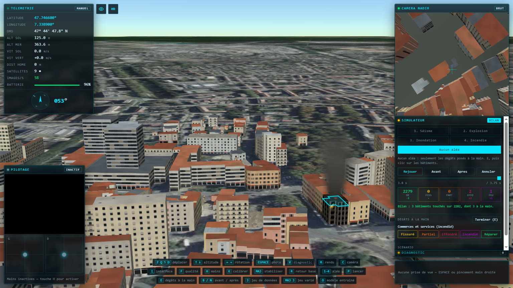

# Simulateur de désastres

Quatre aléas, jouables sur la ville pendant qu'on la survole. Le panneau se
trouve dans la colonne de droite, sous la vue nadir.

| Touche           | Effet                                   |
| ---------------- | --------------------------------------- |
| `1` `2` `3` `4`  | séisme, explosion, inondation, incendie |
| `P`              | lancer ou mettre en pause               |
| `B` / `N`        | sauter avant / après le sinistre        |
| `Retour arrière` | annuler et rendre la ville intacte      |

La ville démarre intacte : tous les dégâts viennent du simulateur. Le bilan
affiche, pour chaque état, le nombre de bâtiments et l'écart à l'état d'avant
le sinistre.


## Le principe : une seule courbe de fragilité

Un bâtiment ne s'effondre pas « parce que le séisme était fort », mais parce que
l'intensité qu'il subit a croisé sa propre vulnérabilité :

```
contrainte = intensité × vulnérabilité × dispersion
```

L'état se lit ensuite dans des seuils : fissuré au-delà de 0,18, effondrement
partiel au-delà de 0,34, effondrement au-delà de 0,52.

- **La vulnérabilité** dépend de l'année de construction, de l'usage, du
  matériau des murs et de l'élancement, tous tirés de la BD TOPO® de l'IGN
  (`computeVulnerability` dans `world/buildings.ts`, détail dans
  [données](donnees.md)). Le raisonnement est celui du génie parasismique : la
  maçonnerie ancienne non chaînée encaisse mal, le béton armé récent encaisse
  bien, et un bâtiment élancé est plus sensible qu'un bâtiment trapu.
- **La dispersion**, ±28 %, empêche la zone sinistrée d'avoir des frontières
  géométriques parfaitement nettes, ce qui ne ressemblerait à aucun sinistre réel.

Cette courbe vit dans `world/fragility.ts` et non dans `disaster/`, à dessein :
elle décrit comment un bâtiment **encaisse**, ce qui est une propriété du bâti et
non de l'aléa. Les quatre aléas la partagent : il n'existe qu'une courbe dans
tout le projet, et elle ne peut pas diverger.

## Quatre aléas, quatre signatures

C'est tout l'intérêt de les mettre côte à côte : ils produisent des cartes de
dégâts de formes très différentes. Relevé sur la ville réelle, 2 282 bâtiments
intacts au départ, avec les réglages par défaut :

| Aléa       | Réglage       | Touchés | Signature                                                                  |
| ---------- | ------------- | ------- | -------------------------------------------------------------------------- |
| Séisme     | intensité VII | 1 187   | toute la ville encaisse : 987 fissurés, 163 partiels, 7 effondrés, 30 feux |
| Explosion  | 1 t de TNT    | 721     | rayon net et brutal : 116 effondrés, 74 incendiés                          |
| Inondation | crue de 3 m   | 228     | suit le relief, pas la distance ; aucun effondrement                       |
| Incendie   | vigueur 1,2   | 270     | une langue sous le vent : 12 % du bâti détruit                             |

### Séisme

Atténuation macrosismique :

```
I = I0 − 3 · log10(R_hypo / h)
```

L'intensité perd environ un degré EMS-98 chaque fois que la distance
hypocentrale double. Elle est convertie en facteur de contrainte en prenant le
degré V comme seuil de ressenti sans dégât et le degré IX comme destruction
généralisée.

Le réglage par défaut, **VII**, est l'intensité estimée à Mulhouse lors du
séisme de Bâle de 1356, le plus fort connu en Europe centrale — une estimation
historique, pas une mesure. À ce degré, l'échelle EMS-98 décrit des fissures
nombreuses dans la maçonnerie ancienne et des effondrements rares : c'est la
signature que donne le simulateur sur la vieille ville.

> **Une entorse assumée.** La zone simulée fait 900 m de côté. Un vrai
> séisme a son foyer à 5-15 km de profondeur et frappe une agglomération de cette
> taille de façon quasi uniforme : il n'y aurait aucun gradient à voir. La
> profondeur focale est donc ramenée à 220 m, ce qui est physiquement faux mais
> rend l'atténuation lisible à l'échelle du quartier. La forme de la loi, elle,
> est conservée.

Les effondrements tardifs sont ceux de bâtiments déjà blessés qui cèdent après
coup — un phénomène bien réel, et la raison pour laquelle on n'entre pas dans un
bâtiment fissuré juste après une secousse.

### Explosion

Loi d'échelle de Hopkinson-Cranz : deux charges différentes produisent la même
surpression à la même **distance réduite** `Z = R / W^(1/3)`. C'est pourquoi
doubler la charge n'élargit le rayon de destruction que de 26 %.

La constante et l'exposant sont ajustés sur les abaques de Kingery-Bulmash, et
non choisis à vue :

| Z (m/kg^1/3)    | 1   | 2   | 5    | 10   | 20   | 40   |
| --------------- | --- | --- | ---- | ---- | ---- | ---- |
| abaque (bar)    | 20  | 5   | 0,9  | 0,30 | 0,12 | 0,05 |
| ce modèle (bar) | 8,4 | 3,2 | 0,90 | 0,34 | 0,13 | 0,05 |

L'écart en champ très proche (Z < 2) est sans conséquence : à cette distance, tout
est détruit de toute façon. Contrôle à l'autre bout de l'échelle : pour la charge
de Beyrouth en 2020 (~1 000 t), le modèle donne un rayon d'effondrement de
1 074 m, contre environ 1 km constaté.

La première version de cette loi se trompait d'un facteur 10 sur la constante et
ne détruisait que trois bâtiments. C'est la comparaison avec l'abaque qui l'a
révélé.

### Inondation

Modèle « de la baignoire », sur le relief réel. La surface de l'eau est
**plane** : elle monte depuis le pied de bâtiment le plus bas de la zone, et
chaque bâtiment se retrouve sous une hauteur d'eau égale à la différence entre ce
niveau et l'altitude de son pied, mesurée par l'IGN. Deux voisins peuvent avoir
des sorts opposés : l'un est dans un creux, l'autre sur un léger relief.

Le centre de Mulhouse ne varie que de quelques mètres, mais c'est tout pour une
crue : avec 3 m d'eau, un quart des pieds de bâtiments sont mouillés, et le point
bas du nord-est se remplit bien avant le reste. C'est le modèle des cartes
réglementaires de zones inondables dans leur forme la plus simple. Sa limite est
connue : il ignore la connectivité — un creux isolé se remplit comme s'il était
relié à la rivière — et la dynamique de l'écoulement.

C'est aussi le seul aléa où le temps fait partie de la physique. Le niveau monte
progressivement et chaque bâtiment est réévalué pas à pas ; la même crue, plus
lente, produit les mêmes dégâts, simplement plus tard. La dispersion y est tirée
une seule fois par bâtiment, sans quoi il oscillerait entre deux états au lieu de
s'aggraver.

Les dégâts sont plafonnés à l'effondrement partiel : une crue noie un
rez-de-chaussée, ruine des planchers et affouille des fondations, mais n'aplatit
pas un immeuble. Seul le bâti très vulnérable en eau profonde peut aller plus
loin.

### Incendie

Aucun champ d'intensité : une propagation de proche en proche. Ce qui brûle
dépend de ce qui a déjà brûlé, et la zone sinistrée est une langue étirée sous le
vent qui s'arrête net sur une rue large.

Trois facteurs décident d'une propagation :

- **l'écart entre façades**, et non entre centres : deux immeubles longs et
  mitoyens se touchent même si leurs centres sont à 40 m ;
- **le vent**, qui couche les flammes et porte les brandons ;
- **la combustibilité**, où le bâti ancien à charpente bois l'emporte de loin sur
  le béton récent.

Calage mesuré sur les 2 282 bâtiments réels, en moyenne sur vingt graines, part
du bâti détruit :

| Vigueur | Part détruite | Comportement                  |
| ------- | ------------- | ----------------------------- |
| 0,5     | 0,5 %         | le feu s'éteint sur place     |
| 1,2     | 10 %          | un grand incendie de quartier |
| 2,0     | 46 %          | l'embrasement général         |

L'écart entre ces trois valeurs n'est pas un défaut de réglage, c'est un seuil
de percolation, propre à tout feu urbain : dans une vieille ville aux bâtiments
mitoyens, en dessous d'une certaine vigueur le feu meurt, au-dessus il trouve
toujours un voisin à allumer. Londres en 1666 en reste l'exemple. À 1,2, tout
près du seuil, le hasard décide : le feu meurt sur place pour six graines sur
vingt.

Ce calage a demandé deux corrections. La première version brûlait toute la ville
quel que soit le réglage, ce qui rendait le curseur de vigueur inutile. En
cherchant pourquoi, il est apparu que l'écart entre façades était calculé avec la
demi-diagonale des bâtiments, qui surestime la taille d'un rectangle allongé :
presque tous les écarts tombaient à zéro.

## Ce qu'on voit

Un bilan chiffré ne dit pas comment un sinistre se déroule. Chaque aléa a donc sa
représentation, construite avec les systèmes de particules et les matériaux de
CesiumJS (`effects/disasterEffects.ts`).


**Explosion.** Un éclair — la lumière de la scène quadruplée pendant deux
dixièmes de seconde — puis une boule de feu qui s'étale en demi-sphère, monte en
refroidissant du blanc à l'orange puis au rouge sombre, et se change en fumée.
L'onde de choc est un dôme translucide qui s'élargit à la vitesse du son et
s'efface à la portée où la surpression retombe sous 0,03 bar, celle de la
simulation : c'est le voile de condensation des vidéos de Beyrouth. Des débris
retombent en cloche sous la pesanteur, et une colonne de fumée monte pendant une
quinzaine de secondes.


**Incendies.** Les flammes naissent sur toute l'emprise du toit, chaque bâtiment
en feu porte sa colonne de fumée, et un bâtiment consumé fume encore après
l'extinction. Il garde ses murs : ses baies vides et la suie qui monte au-dessus
de chacune le signalent, là où un effondrement laisse des gravats. Les séismes et
les explosions allument aussi des feux, par les réseaux de gaz.


**Inondation.** Une nappe plane, relevée à mesure que l'eau monte, et découpée
par le relief : là où le sol est plus haut que l'eau, le test de profondeur la
cache. Elle est boueuse — une crue charrie la terre qu'elle arrache — et reflète
le ciel quand on la regarde de biais, comme toute eau (facteur de Fresnel).


_Inondation près de la gare. Relevé 3D : Google._

**Séisme.** Les effondrements soulèvent un nuage de poussière, et la caméra
tremble. Cette secousse est une convention empruntée au cinéma : un drone en vol
ne ressent pas un séisme, mais sans elle rien ne dirait à l'écran que le sol
tremble.

Tous ces effets suivent le **temps de la chronologie**, pas l'horloge : le niveau
de l'eau, les bâtiments en feu et le rayon de l'onde se déduisent de l'instant
affiché. Revenir en arrière fait redescendre l'eau. Seuls les effets ponctuels —
boule de feu, poussière — ne naissent que pendant une lecture vers l'avant : un
saut direct au bilan n'en fait pas jaillir des centaines.

Les vues diagnostique et scan masquent les effets, qui brouilleraient la lecture
de la classification. Le sinistre continue de se dérouler, sans être dessiné.

Leur coût, et les deux pièges de Cesium qu'il a fallu contourner, sont détaillés
dans [performance](performance.md#effets-de-particules).

## Une chronologie précalculée

Tout le sinistre est calculé avant la première image et stocké comme une liste
d'événements horodatés. Rien n'est décidé pendant la lecture, avec trois
conséquences voulues :

1. **Rejouable** — même scénario et même graine donnent le même sinistre, au
   bâtiment près. Sans cela, la partie diagnostic perdrait son sens.
2. **Parcourable dans les deux sens** — on peut revenir en arrière, ce qu'une
   simulation incrémentale ne permet pas sans tout rejouer.
3. **Bilan immédiat** — l'état final est connu avant d'avoir joué une seconde,
   donc la comparaison avant/après est disponible tout de suite.

Vérifié : deux constructions du même scénario donnent des chronologies identiques
événement par événement, une autre graine en donne une différente, et annuler un
sinistre rend exactement l'état d'avant.

Un bâtiment ne passe pas d'intact à effondré d'un coup : pendant une secousse, il
se fissure, s'effondre partiellement, puis cède. La chronologie restitue ces
étapes intermédiaires, qui font sa lisibilité.

Le coût des reconstructions de géométrie pendant la lecture est détaillé dans
[performance](performance.md#reconstructions-pendant-un-sinistre).

## Dégâts posés à la main



Au-delà des quatre aléas, on peut choisir soi-même les bâtiments touchés.

1. `E` (ou « Sélectionner » dans le panneau) passe en sélection : le curseur
   devient un réticule.
2. Un clic sur la vue choisit le bâtiment visé ; `Maj` + clic en ajoute ou en
   retire un ; un clic dans le vide vide la sélection. Les bâtiments choisis
   sont entourés en cyan, au niveau de leur toit.
3. Les boutons du panneau leur donnent un état, par gravité croissante :
   fissuré, effondrement partiel (toit écrêté, premiers gravats), effondré (tas
   de gravats), ou incendié (façade noircie, flammes puis fumée). « Réparer »
   les remet intacts.

Le bâtiment visé est trouvé par la profondeur de l'image sous le curseur, puis
par le contour de l'IGN qui contient ce point : la sélection marche aussi bien
sur la ville dessinée que sur le relevé photoréaliste de Google.

Ces dégâts deviennent des événements de la chronologie, placés après ceux de
l'aléa : ils ont le dernier mot sur un bâtiment que l'aléa avait aussi touché.
L'avant / après, la lecture, la poussière des effondrements, les flammes et le
bilan s'appliquent donc à eux comme à un aléa. Sans aléa (« Aucun aléa »), ils
se produisent l'un après l'autre en deux secondes. Avec un aléa, ils
s'ajoutent à lui : on peut jouer une explosion, puis effondrer à la main un
bâtiment qu'elle avait épargné.

Un fissuré reste dessiné comme un bâtiment intact : une fissure ne se voit pas
du ciel à cette échelle. C'est aussi ce qui le rend invisible au détecteur
entraîné (voir [détecteur entraîné](detecteur-entraine.md)).

## Scénarios en JSON

Le panneau enregistre le scénario en cours dans un fichier JSON, et en
recharge un : de quoi le garder, le rejouer ou le partager.

```json
{
  "format": "drone-recon/scenario",
  "version": 1,
  "name": "Exemple : explosion et dégâts posés à la main",
  "city": { "name": "Mulhouse — centre", "lon": 7.3389, "lat": 47.7466 },
  "hazard": {
    "kind": "explosion",
    "magnitude": 1,
    "east": 60,
    "north": 40,
    "windFrom": 225,
    "seed": 7301,
    "duration": 20
  },
  "buildings": [
    { "id": "BATIMENT0000000228119335", "state": "collapsed", "name": "Immeuble résidentiel" }
  ],
  "viewpoint": { "lon": 7.3370297, "lat": 47.7450729, "agl": 70, "heading": 20 }
}
```

| Champ       | Contenu                                                                     |
| ----------- | --------------------------------------------------------------------------- |
| `hazard`    | l'aléa et ses réglages, ou `null` pour des dégâts posés à la main seulement |
| `buildings` | les dégâts posés à la main : identifiant BD TOPO® et état                   |
| `viewpoint` | la position, la hauteur et le cap du drone à l'enregistrement               |
| `city`      | la ville du scénario ; un scénario fait ailleurs est refusé                 |

L'aléa n'est décrit que par ses réglages et sa graine : la chronologie est
déterministe, et elle se reconstruit à l'identique au chargement, sans qu'il
faille enregistrer l'état de deux mille bâtiments. Les bâtiments sont désignés
par leur identifiant dans la BD TOPO®, qui ne change pas si l'on retélécharge
les données.

Au chargement, chaque champ est vérifié ; un fichier mal formé est refusé avec
la raison (« aléa inconnu », grandeur hors limites…), et un bâtiment inconnu
est ignoré et signalé. Le drone rejoint le point de vue enregistré, et la vue
montre l'état final : `B` / `N` pour comparer avant et après.

Un exemple : [`scenarios/exemple-explosion.json`](../scenarios/exemple-explosion.json).
